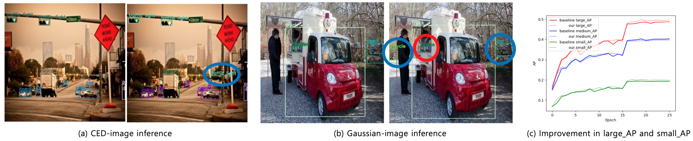

# Feature-Enhancement-for-Object-Detectors

This is the official implementation of Paper Feature Enhancement for Object Detectors.



* (a) : The early stage of the backbone is trained to detect small features more effectively, similar to the characteristics of an Canny Edge Detector(CED).
* (b) : The later stage of the backbone is trained to blur small features, like a Gaussian filter, and focus more on detecting larger features.
* (c) : The new training method leads to an increase in AP (Average Precision) for both large and small objects.


## Training and Evaluation on COCO

<details>
  <summary>Requirements</summary>
  We conducted experiments on the following environment:

  - python 3.11.9
  - pytorch 2.0.1, torchvision 0.15.2
  - CUDA 12.4
</details>

<details>
  <summary>Data Preparation</summary>
  Download COCO train and val images from https://cocodataset.org.
  </br>We expect the directory structure to be as follows:
  
  ``` 
  path/to/coco/
    ├── annotations/
    │   ├── instances_train2017.json
    │   └── instances_val2017.json
    ├── train2017/
    │   ├── 000000000009.jpg
    │   ├── 000000000025.jpg
    │   └── ...
    └── val2017/
        ├── 000000000139.jpg
        ├── 000000000285.jpg
        └── ... 
  ```
</details>

<details>
  <summary>Training</summary>
  To train RetinaNet with Feature-Enhancement, run the following command:
  </br>If the number of GPUs used is different, the learning rate should be adjusted accordingly. Refer to the PyTorch Detection Training in [train.py](https://github.com/LeeHyungSeop/Feature-Enhancement-for-Object-Detectors/blob/main/RetinaNet/train.py) for details.

  ```
  torchrun --nproc_per_node=2 train.py \
  --dataset coco --data-path=<path to coco> --model my_retinanet_resnet50_fpn \
  --epochs 26 --lr-steps 16 22 --aspect-ratio-group-factor 3 \
  --lr 0.005 --batch-size 2 --world-size 2 \
  --weights-backbone ResNet50_Weights.IMAGENET1K_V1 \
  --output-dir <checkpoint directory>
  ```
</details>

<details>
  <summary>Evaluation</summary>
    To evaluate the pretrained model, run the following command:
    ```
    python eval.py --dataset coco --data-path=<path to coco> --model my_retinanet_resnet50_fpn \
    ```
</details>


## Citation

Please use the following BibTeX entries:

``` bibtex
@article{,
  title={Feature-Enhancement-for-Object-Detectors},
  author={},
  journal={},
  year={2024},
}
```
